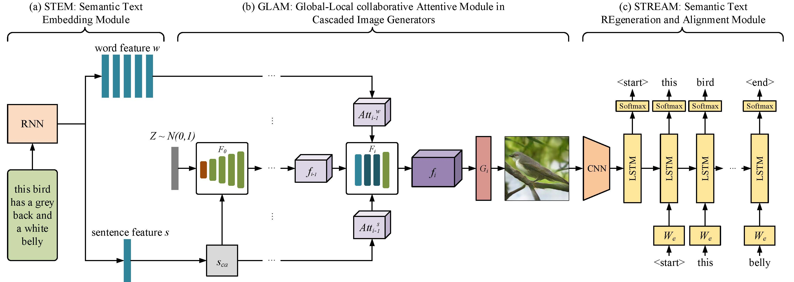

# MirrorGAN

Pytorch implementation for Paper [MirrorGAN: Learning Text-to-image Generation by Redescription](https://arxiv.org/abs/1903.05854) by Tingting Qiao, Jing Zhang, Duanqing Xu, Dacheng Tao. (The work was performed when Tingting Qiao was a visiting student at UBTECH Sydney AI Centre in the School of Computer Science, FEIT, the University of Sydney).



## Getting Started
### Installation

- Install PyTorch and dependencies from http://pytorch.org
- Install Torch vision from the source.

- Clone this repo:
```bash
git clone https://github.com/qiaott/MirrorGAN.git
cd MirrorGAN
```
- Download our preprocessed data from [here](https://drive.google.com/file/d/1CuW5ognTSkNbyx9TWoUFrgwqxZNk1cl0/view?usp=sharing).

- The STEM was pretrained using the code provided [here](https://github.com/taoxugit/AttnGAN)

- The STREAM was pretrained using the code provided [here](https://github.com/yunjey/pytorch-tutorial/tree/master/tutorials/03-advanced/image_captioning).

### Train/Test

After obtaining the pretrained STEM and STREAM modules, we can train the text2image model.
- Train a model:
```bash
./do_train.sh
```
- Test a model:
```bash
./do_test.sh
```

## Citation
If you use this code for your research, please cite our paper.

```bash
@article{qiao2019mirrorgan,
  title={MirrorGAN: Learning Text-to-image Generation by Redescription},
  author={Qiao, Tingting and Zhang, Jing and Xu, Duanqing and Tao, Dacheng},
  journal={Proceedings of the IEEE Conference on Computer Vision and Pattern Recognition},
  year={2019}
}
```